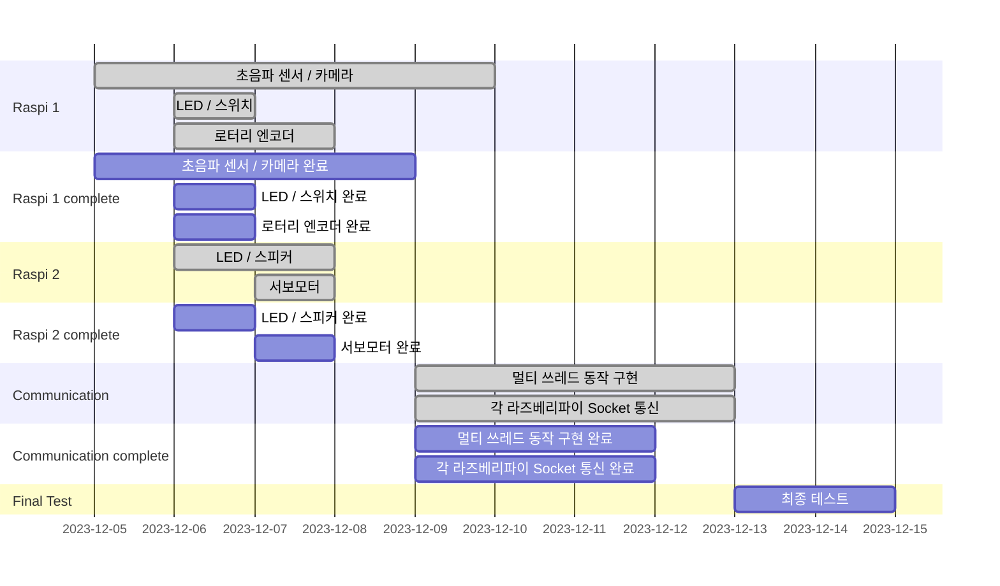

# Final_Project
임베디드 시스템 기말 대체 프로젝트를 위한 레포지토리 입니다. **2분반 1조**


## 목차
- [조원 및 역할](#조원)
- [일정 정리](#일정-정리)
- [1차 계획 발표 내용 정리](#1차-계획-발표-내용)
- [2차 계획 수립](#2차-계획-수립)
- [개발 현황 정리](#개발-현황-정리)
- [개발 계획 대비 진행 상황](#개발-계획-대비-진행-상황)
- [각 엑츄에이터 정의](#각-엑추에이터의-정의)
- [각 기능 세부 설명](#각-기능-세부-설명)
- [코드 구조](#코드-구조)
- [개발 시 문제점 및 해결 방안](#개발-시-문제점-및-해결-방안)
- [프로젝트 구현 결과](#프로젝트-구현-결과)


<hr>


###    조원

|학번|이름|역할|
|------|---|---|
|20190053|곽지호|프로젝트 총괄, LED / 스피커 구현|
|20210104|김경미|LED/스위치 구현, 서보모터 구현|
|20210347|김현서|로터리 엔코더 구현|
|20210908|이지윤|초음파 센서/ 카메라 구현|

<hr>

### 일정 정리
|기한|내용|
|------|---|
|12월 14일|프로젝트 결과 발표 제출[팀장 제출]|
|12월 15일|프로젝트 결과 발표[발표자]|
|~~12월 21일~~ 12월 15일|전체 시스템 데모|
|12월 21일|팀원 상호 평가 제출[개인 제출]|
|12월 21일|Github [보고서 대체] 제출|


### 1차 계획 발표 내용


<hr>

### 2차 계획 수립
**(1차 계획 발표와 변경된 점)**
- 엑추에이터들의 순차적 동작이 아닌 동시성 처리를 위한 쓰레드/뮤텍스 구성 (~~기존에는 멀티 프로세스 동작~~)


- 각 라즈베리 파이의 엑추에이터 세팅 계획
- 엑추에이터를 다양하게 사용하는 것을 목적으로 하는 프로젝트로 많은 엑추에이터를 사용하다 보니 하나의 라즈베리 파이에 연결하기에는 GPIO PORT 부족 => 두 개의 라즈베리 파이 사용


- ~~위와 같은 이유로 두 개의 라즈베리파이간 통신을 위해 UART 통신 계획(12.09) [변경]~~
- 라즈베리 파이의 블루투스 기능의 구현 모호함으로 기존의 UART 통신 방식에서 소켓 통신 방식으로 통신 변경

- **카메라를 통한 얼굴 인식장치**는 **OpenCV 라이브러리**를 사용해야 하는 관계로 해당 로직만 **Python 언어**를 사용해 구현 [**초음파 센서**를 **포함한** 나머지 모든 코드는 **C언어**로 작성]**


### 실제 구현 내용

- LED/Button 잠금 장치
- 로터리 엔코더 잠금 장치
- 초음파 센서 와 카메라를 통한 얼굴 인식 잠금 장치
- LED/스피커를 통한 경고 장치
- 서보 모터를 사용한 잠금 해제 장치

- 라즈베리 파이 통신 방식을 UART 에서 Socket 방식으로 변경
- 멀티프로세스 방식이 아닌 쓰레드/뮤텍스 방식으로 변경


### 개발 현황 정리
|개발 내용|완료 여부|담당자|
|------|---|---|
|스피커/LED 경고 엑추에이터 구현|완료|곽지호|
|LED/스위치 구현|완료|김경미|
|서보모터 구현|완료|김경미|
|로터리 엔코더 구현|완료|김현서|
|초음파 센서/카메라 구현|완료|이지윤|
|멀티 쓰레드 동작 구현|진행 중(12.9, 12.10, 12.11), 완료(12.13)|곽지호, 김경미, 김현서, 이지윤|
|각 라즈베리 파이의 socket 통신|진행 중(12.9 ,12.10, 12.11), 완료(12.13)|곽지호, 김경미, 김현서, 이지윤|
- 참고 사이트[ https://blog.naver.com/zeta0807/221269996160 ]

### 개발 계획 대비 진행 상황


<hr>


### 각 엑추에이터의 정의
- 기능 정리
	- 잠금 장치
		- LED/스위치 잠금장치
		- 로터리 엔코더 잠금장치
		- 초음파/카메라 잠금장치

	- 경고 장치 [ 잠금 해제를 실패한 경우 ]
		- 스피커/LED 경고 장치
		
	- 잠금 해제 장치
		- 서보모터 장금 해제 장치
		
### 각 기능 세부 설명	

**1. 스피거/LED 경고 장치**

	- 3개의 잠금창치에서 3번이상 오류가 발생할 경우 스피커와 LED 를 통한 경고장치 동작
	
**2. LED/스위치 잠금장치**

	- 5개의 LED와 스위치를 이용하여 정해진 입력값의 LED를 키면 잠금 해제
**3. 서보모터 잠금 해제 장치**

	- 잠금 장치 3개를 모두 해제한 경우 서보모터 동작	
**4. 로터리 엔코더 잠금장치**

	- 사용자가 정해둔 시계 방향, 반시계 방향만큼 회전시키면 잠금 해제
**5. 초음파/카메라 장치**

   	- 초음파 장치로 일정 거리 안에 사용자가 있다고 판단되면 카메라 작동
   	- 얼굴 인식
   	  	- 10초 간 얼굴 인식이 진행되며, 사용자의 얼굴이 인식될 경우 사용자로 판단 및 확인 전달
   	  	- 10초 간 사용자의 얼굴이 인식 안되거나, 미사용자 얼굴이 계속 인식될 경우, 오류 전달
       	- OpenCV haarcascade 사용	

<hr>

### 코드 구조

- **raspberryPi_1**
	- obj [목적파일]
	- src [소스코드]
	- train [얼굴 인식 모듈 사용]
	- OpenCV [OpenCV 라이브러리]
	- Makefile [Make 유틸리티]
	- main [실행파일]	

- **raspberryPi_2**
	- obj [목적파일]
	- src [소스코드]
	- Makefile [Make 유틸리티]
	- main [실행파일]	

**Makefile : src 안에 있는 코드 모두를 대상으로 하여 목적파일 생성.**

<hr>

### 개발 시 문제점 및 해결 방안
#### 1. 카메라 설치 관련 문제
```python
ret, img = cam.read()
gray = cv2.cvtColor(img,cv2.COLOR_BGR2GRAY)
```
```
-215:Assertion failed !_src.empty() in function 'cvtColor'
```
위와 같은 코드에서 !_src.empty() 오류가 발생하였고, 이는 라즈베리파이에 카메라 설치 관련 오류가 생겼다 판단되어 코드에 디버깅 과정을 추가하여 작동해 보았다.</br>
```python
cam = cv2.VideoCapture(0)
if not cam.isOpened():
    print("에러: 카메라를 열 수 없습니다.\n")
# ~생략~
ret, img = cam.read()
if not ret:
    print("에러: 카메라에서 프레임을 읽는 데 실패했습니다.\n")
    continue
```
해당 디버깅 결과로, 프레임(ret)을 읽는 것에 실패했음을 알 수 있었다. 원인을 해결하기 위해 아래와 같은 과정을 진행하였다.
-  sudo raspi-config  → Interfacing Options → Legacy Camera → Enable
- lsmod | grep bcm2835
- sudo reboot
- raspistill -o cam.jpg 

위와 같이 문제 해결을 위해 라즈베리파이 설정을 업데이트하고 카메라 모듈을 활성화하는 등의 조치를 취하였다. 초기에는 이러한 조치로 문제가 해결되었지만, 이후 다시 동일한 오류가 발생하였다. 이 경우 카메라 모듈이나 라즈베리파이의 카메라 포트에 손상이 있을 수 있다고 판단된다.

### 2. 카메라 모듈의 파이썬 이용시 C언어와 상호작용 문제점
 모든 언어를 C언어로 구현하고자 하였으나 카메라 모듈의 경우 openCV2를 사용해야 함. 
이를 위해 파이썬 언어를 사용하여 카메라 모듈의 얼굴 인식을 적용하였지만, C언어 코드 상에 변수 값을 return 받지 못하는 문제가 발생하였다. 
```
pass_camera = system("python3 src/camRecog.py");
```
코드는 다음과 같으며 system 의 python3 를 호출하여 return 값을 받는 구조이지만 값을 정상적으로 받지 못하였다.

 위 문제를 해결하기 위해 Python 프로세스를 호출하면 결과를 특정 위치의 파일 입출력으로 "1", "0" 을 쓰는 방식으로 변경하였고, 이 파일을 읽음으로써 프로세스의 결과 값을 정상적으로 인가 받을 수 있었다.
 
###   프로젝트 구현 결과
https://youtube.com/shorts/uNs-Yv23Zb4?feature=share

### requirements
- python
  - OpenCV2

