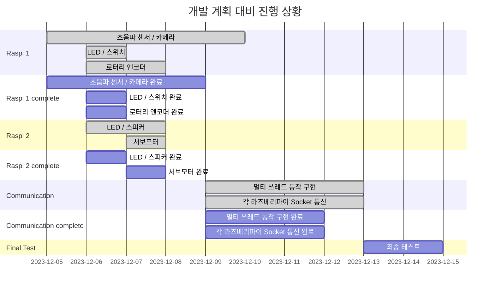

# Final_Project
임베디드 시스템 기말 대체 프로젝트를 위한 레포지토리 입니다. **2분반 1조**
## 목차
- [조원 및 역할](#조원)
- [일정 정리](#일정-정리)
- [1차 계획 발표 내용 정리](#1차-계획-발표-내용)
- [2차 계획 수립](#2차-계획-수립)
- [개발 현황 정리](#개발-현황-정리)
- [각 엑츄에이터 정의](#각-엑추에이터-정의)
- [각 기능 세부 설명](#각-기능-세부-설명)
- [개발 시 문제점 및 해결 방안](#개발-시-문제점-및-해결-방안)
- [프로젝트 구현 결과](#프로젝트-구현-결과)

###    조원

|학번|이름|역할|
|------|---|---|
|20190053|곽지호|프로젝트 총괄, LED / 스피커 구현|
|20210104|김경미|LED/스위치 구현, 서보모터 구현|
|20210347|김현서|로터리 엔코더 구현|
|20210908|이지윤|초음파 센서/ 카메라 구현|

### 일정 정리
|기한|내용|
|------|---|
|12월 14일|프로젝트 결과 발표 제출[팀장 제출]|
|12월 15일|프로젝트 결과 발표[발표자]|
|12월 21일|팀원 상호 평가 제출[개인 제출]|
|12월 21일|Github [보고서 대체] 제출|
|12월 21일|전체 데모 영상 제작 및 발표|

### 1차 계획 발표 내용

### 2차 계획 수립
**(1차 계획 발표와 변경된 점)**
- 엑추에이터들의 순차적 동작이 아닌 동시성 처리를 위한 쓰레드/뮤텍스 구성 (~~기존에는 멀티 프로세스 동작~~)

- 각 라즈베리 파이의 엑추에이터 세팅 계획
- 엑추에이터를 다양하게 사용하는 것을 목적으로 하는 프로젝트로 많은 엑추에이터를 사용하다 보니 하나의 라즈베리 파이에 연결하기에는 GPIO PORT 부족 => 두 개의 라즈베리 파이 사용

- ~~위와 같은 이유로 두 개의 라즈베리파이간 통신을 위해 UART 통신 계획(12.09) [변경]~~
- 라즈베리 파이의 블루투스 기능의 구현 모호함으로 기존의 UART 통신 방식에서 소켓 통신 방식으로 통신 변경

- **카메라를 통한 얼굴 인식장치**는 **OpenCV 라이브러리**를 사용해야 하는 관계로 해당 로직만 **Python 언어**를 사용해 구현 [**초음파 센서**를 **포함한** 나머지 모든 코드는 **C언어**로 작성]**

### 실제 구현 내용

- LED/Button 잠금 장치
- 로터리 엔코더 잠금 장치
- 초음파 센서 와 카메라를 통한 얼굴 인식 잠금 장치
- LED/스피커를 통한 경고 장치
- 서보 모터를 사용한 잠금 해제 장치

- 라즈베리 파이 통신 방식을 UART 에서 Socket 방식으로 변경
- 멀티프로세스 방식이 아닌 쓰레드/뮤텍스 방식으로 변경

### 개발 현황 정리
|개발 내용|완료 여부|담당자|
|------|---|---|
|스피커/LED 경고 엑추에이터 구현|완료|곽지호|
|LED/스위치 구현||
|서보모터 구현|완료|김경미|
|로터리 엔코더 구현|완료|김현서|
|초음파 센서/카메라 구현|완료|이지윤|
|멀티 쓰레드 동작 구현|진행 중(12.10, 12.11), 완료(12.13)|곽지호, 김경미, 김현서, 이지윤|
|각 라즈베리 파이의 socket 통신|진행 중(12.10, 12.11)|곽지호, 김경미, 김현서, 이지윤|
- 참고 사이트[ https://blog.naver.com/zeta0807/221269996160 ]
  

### 각 엑추에이터의 정의
- 기능 정리
	- 잠금 장치
		- LED/스위치 잠금장치
		- 로터리 엔코더 잠금장치
		- 초음파/카메라 잠금장치

	- 경고 장치 [ 잠금 해제를 실패한 경우 ]
		- 스피커/LED 경고 장치
		
	- 잠금 해제 장치
		- 서보모터 장금 해제 장치
		
### 각 기능 세부 설명	

**1. 스피거/LED 경고 장치**

	- 3개의 잠금창치에서 3번이상 오류가 발생할 경우 스피커와 LED 를 통한 경고장치 동작
	
**2. LED/스위치 잠금장치**

	- 5개의 LED와 스위치를 이용하여 정해진 입력값의 LED를 키면 잠금 해제
**3. 서보모터 잠금 해제 장치**

	- 잠금 장치 3개를 모두 해제한 경우 서보모터 동작	
**4. 로터리 엔코더 잠금장치**

	- 사용자가 정해둔 시계 방향, 반시계 방향만큼 회전시키면 잠금 해제
**5. 초음파/카메라 장치**

   	- 초음파 장치로 일정 거리 안에 사용자가 있다고 판단되면 카메라 작동
   	- 얼굴 인식
   	  	- 10초 간 얼굴 인식이 진행되며, 사용자의 얼굴이 인식될 경우 사용자로 판단 및 확인 전달
   	  	- 10초 간 사용자의 얼굴이 인식 안되거나, 미사용자 얼굴이 계속 인식될 경우, 오류 전달
       	- OpenCV haarcascade 사용	

### 개발 시 문제점 및 해결 방안

###   프로젝트 구현 결과
